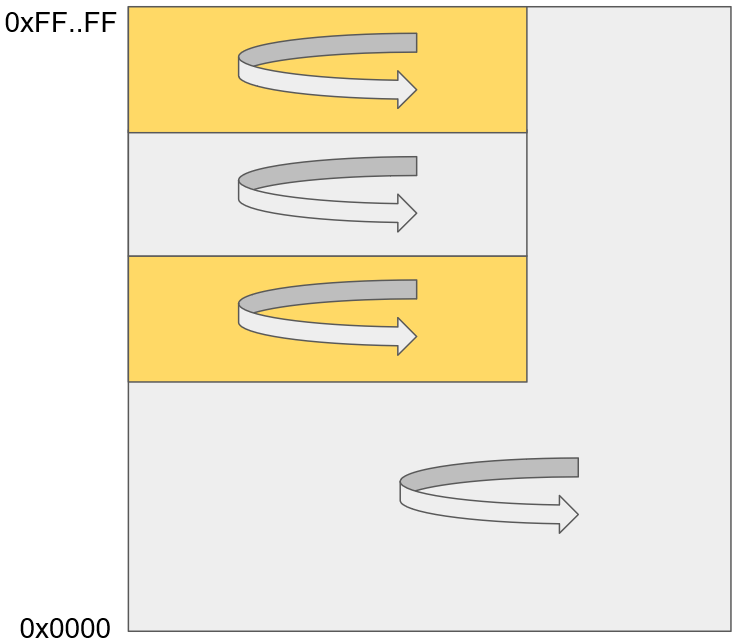

[[risc-v-pointer-masking-proposal]]
# RISC-V Pointer Masking proposal

_Adam Zabrocki_, _Lee Campbell_, _Martin Maas_, _RISC-V TEE_ and _J Extension Task Groups_

**Contributors: ** [Members of the TEE and J Extension Task Groups]

[[introduction]]
## Introduction

RISC-V Pointer Masking (PM) is a feature which provides a possibility of implementing “memory tagging” by ignoring various bits (defined by mask) of the [.underline]#_effective address_# (virtual or physical) on RV128, RV64 and RV32.

[.underline]#_Effective address_# is an address generated by the address generation logic before it is sent to the memory subsystem. As such, there is no special handling of physical vs. virtual memory at the software level.

Memory tagging (MT) is a technique which can significantly improve the memory safety state of any application (including code running in more privileged modes). MT can be fully implemented in the hardware or partially hardware assisted. However, both implementations require a PM feature to be enabled to not overwhelm the performance.

General idea of MT is based on assigning a tag to every granule of memory (a small, e.g. 16-byte, naturally aligned memory region). All accesses to memory must be made via a pointer with the correct tag. Use of an incorrect tag is noted and the monitor software can choose what to do with such a situation (e.g. could be killing the process, or just report it to the user immediately). To be able to store the tag in every memory pointer (poisoning the pointer) and correctly using it in running applications without significant performance impact, PM is necessary.

This document proposes an extension for RISC-V called PM (Pointer Masking) which in the future might be enhanced for implementing a full hardware memory tagging.

[[proposal]]
## Proposal

We propose to add:

* new PM configuration CSR register called _**MMTE**_ (Memory Tagging Extension)
* new PM pointer masking CSR register for each privilege level called _**MPMMASK**_ (Pointer Masking Mask)
* new PM pointer base CSR register for S-mode and U-mode called _**SPMBASE**_ (Pointer Masking Base)

Restricted views of the _**mmte**_ register appear as the _**hmte**_, _**smte**_ and _**umte**_ registers in the HS-level, S-level and U-level ISAs respectively.

Restricted views of the _**mpmmask**_ register appear as the _**hpmmask**_, _**spmmask**_ and _**upmmask**_ registers in the HS-level, S-level and U-level ISAs respectively.

Restricted view of the _**spmbase**_ register appear as the _**upmbase**_ registers in the U-level ISA.

The purpose of the _**mpmmask**_ register is to be able to precisely define a mask which bits of the effective address are ignored. Actual address can be calculated by using requested address and _**mpmmask**_ register:

[source]
----
actual_address = (requested_address & ~mpmmask) | (0 & mpmmask)
----

Additionally, S-mode and U-mode can define _**spmbase**_ / _**upmbase**_ register which allows the user to set the top bits of the actual_address (instead of zeros). The top bits of the requested_address are still ignored and can still be used for any tagging purpose.

If _**spmbase**_ register is set (has value other than zero) actual address can be calculated by using requested address, _**mpmmask**_ and _**spmbase**_ register:

[source]
----
actual_address = (requested_address & ~mpmmask) | (spmbase & mpmmask)
----

When PM extension is enabled, _**mpmmask**_ and _**spmbase**_ registers allow to implement in-process isolation feature. That feature allows for each thread to be isolated to a given block of the address space. It can be used to isolate untrusted code within a process. A high-level concept can be seen at Picture 1.

Picture 1: In-Process isolation leveraging _**mpmmask**_ and _**spmbase**_ registers

_**MMTE**_ layout can be found in Figure 1a, 1b, 1c and 1d for RV32, Figure 2a, 2b, 2c and 2d for RV64 and Figure 3a, 3b, 3c and 3d for RV128. Table 1 explains the meaning of _PM_ bits for RV32, RV64 and RV128. Table 2 explains the meaning of _xTE_ (PM Enforce) bits.

_**MPMMASK**_ layout can be found in Figure 4a, 4b, 4c and 4d for RV32, Figure 5a, 5b, 5c and 5d for RV64 and Figure 6a, 6b, 6c and 6d for RV128.

_**SPMBASE**_ layout can be found in Figure 7a and 7b for RV32, Figure 8a and 8b for RV64 and Figure 9a and 9b for RV128.

[%header, cols=6*]
,===
mmte[31:9],mmte[8:8],mmte[7:7],mmte[6:6],mmte[5:2],mmte[1:0]
WPRI,HTE,STE,UTE,WPRI,PM
,===
Figure 1a: Memory Tagging Extension register (_**mmte**_) for RV32 (M-MODE) +
 +

[%header, cols=6*]
,===
hmte[31:9],hmte[8:8],hmte[7:7],hmte[6:6],hmte[5:2],hmte[1:0]
WPRI,HTE,STE,UTE,WPRI,PM
,===
Figure 1b: Memory Tagging Extension register (_**hmte**_) for RV32 (H-mode) +
 +

[%header, cols=5*]
,===
smte[31:8],smte[7:7],smte[6:6],smte[5:2],smte[1:0]
WPRI,STE,UTE,WPRI,PM
,===
Figure 1c: Memory Tagging Extension register (_**smte**_) for RV32 (S-mode) +
 +

[%header, cols=4*]
,===
umte[31:7],umte[6:6],umte[5:2],umte[1:0]
WPRI,UTE,WPRI,PM
,===
Figure 1d: Memory Tagging Extension register (_**umte**_) for RV32 (U-mode) +
 +

[%header, cols=6*]
,===
mmte[63:9],mmte[8:8],mmte[7:7],mmte[6:6],mmte[5:2],mmte[1:0]
WPRI,HTE,STE,UTE,WPRI,PM
,===
Figure 2a: Memory Tagging Extension register (_**mmte**_) for RV64 (M-MODE) +
 +

[%header, cols=6*]
,===
hmte[63:9],hmte[8:8],hmte[7:7],hmte[6:6],hmte[5:2],hmte[1:0]
WPRI,HTE,STE,UTE,WPRI,PM
,===
Figure 2b: Memory Tagging Extension register (_**hmte**_) for RV64 (H-mode) +
 +

[%header, cols=5*]
,===
smte[63:8],smte[7:7],smte[6:6],smte[5:2],smte[1:0]
WPRI,STE,UTE,WPRI,PM
,===
Figure 2c: Memory Tagging Extension register (_**smte**_) for RV64 (S-mode) +
 +

[%header, cols=4*]
,===
umte[63:7],umte[6:6],umte[5:2],umte[1:0]
WPRI,UTE,WPRI,PM
,===
Figure 2d: Memory Tagging Extension register (_**umte**_) for RV64 (U-mode) +
 +

[%header, cols=6*]
,===
mmte[127:9],mmte[8:8],mmte[7:7],mmte[6:6],mmte[5:2],mmte[1:0]
WPRI,HTE,STE,UTE,WPRI,PM
,===
Figure 3a: Memory Tagging Extension register (_**mmte**_) for RV128 (M-MODE) +
 +

[%header, cols=6*]
,===
hmte[127:9],hmte[8:8],hmte[7:7],hmte[6:6],hmte[5:2],hmte[1:0]
WPRI,HTE,STE,UTE,WPRI,PM
,===
Figure 3b: Memory Tagging Extension register (_**hmte**_) for RV128 (H-MODE) +
 +

[%header, cols=5*]
,===
smte[127:8],smte[7:7],smte[6:6],smte[5:2],smte[1:0]
WPRI,STE,UTE,WPRI,PM
,===
Figure 3c: Memory Tagging Extension register (_**smte**_) for RV128 (S-mode) +
 +

[%header, cols=4*]
,===
umte[127:7],umte[6:6],umte[5:2],umte[1:0]
WPRI,UTE,WPRI,PM
,===
Figure 3d: Memory Tagging Extension register (_**umte**_) for RV128 (U-mode) +
 +

[cols=",",]
|===========================================================================================================================
|*Value* |*Meaning*
|00 |PM is disabled (_default_) and _**xPMMASK**_ and _**xPMBASE**_ registers can only be modified by the higher privilege level
|01 |PM is enabled and _**xPMMASK**_ and _**xPMBASE**_ registers can only be modified by the higher privilege level
|10 |PM is disabled and _**xPMMASK**_ and _**xPMBASE**_ registers can be modified by the same privilege level
|11 |PM is enabled and _**xPMMASK**_ and _**xPMBASE**_ registers can be modified by the same privilege level
|===========================================================================================================================
Table 1: Meaning of _PM_ bits for RV32, RV64 and RV128 +
 +

[cols=",",]
|=============================================
|*Bit* |*Meaning*
|_UTE_ a|
Enforce _PM_ in U-mode
______________________________________________
* 0 – don’t enforce _PM_ in U-mode (_default_)
* 1 – enforce _PM_ in U-mode
______________________________________________

|_STE_ a|
Enforce _PM_ in S-mode

____________________________________________
* 0 – don’t enforce PM in S-mode (_default_)
* 1 – enforce _PM_ in S-mode
____________________________________________

|_HTE_ a|
Enforce _PM_ in H-mode

______________________________________________
* 0 – don’t enforce _PM_ in H-mode (_default_)
* 1 – enforce _PM_ in H-mode
______________________________________________

|=============================================
Table 2: Meaning of _PM_ Enforce bits +
 +

[%header, cols=1*]
,===
mpmmask[31:0]
MASK
,===
Figure 4a: Memory Tagging Extension register (_**mpmmask**_) for RV32 (M-MODE) +
 +

[%header, cols=1*]
,===
hpmmask[31:0]
MASK
,===
Figure 4b: Memory Tagging Extension register (_**hpmmask**_) for RV32 (H-MODE) +
 +

[%header, cols=1*]
,===
spmmask[31:0]
MASK
,===
Figure 4c: Memory Tagging Extension register (_**spmmask**_) for RV32 (S-MODE) +
 +

[%header, cols=1*]
,===
upmmask[31:0]
MASK
,===
Figure 4d: Memory Tagging Extension register (_**upmmask**_) for RV32 (U-MODE) +
 +

[%header, cols=1*]
,===
mpmmask[63:0]
MASK
,===
Figure 5a: Memory Tagging Extension register (_**mpmmask**_) for RV64 (M-MODE) +
 +

[%header, cols=1*]
,===
hpmmask[63:0]
MASK
,===
Figure 5b: Memory Tagging Extension register (_**hpmmask**_) for RV64 (H-MODE) +
 +

[%header, cols=1*]
,===
spmmask[63:0]
MASK
,===
Figure 5c: Memory Tagging Extension register (_**spmmask**_) for RV64 (S-MODE) +
 +

[%header, cols=1*]
,===
upmmask[63:0]
MASK
,===
Figure 5d: Memory Tagging Extension register (_**upmmask**_) for RV64 (U-MODE) +
 +

[%header, cols=1*]
,===
mpmmask[127:0]
MASK
,===
Figure 6a: Memory Tagging Extension register (_**mpmmask**_) for RV128 (M-MODE) +
 +

[%header, cols=1*]
,===
hpmmask[127:0]
MASK
,===
Figure 6b: Memory Tagging Extension register (_**hpmmask**_) for RV128 (H-MODE) +
 +

[%header, cols=1*]
,===
spmmask[127:0]
MASK
,===
Figure 6c: Memory Tagging Extension register (_**spmmask**_) for RV128 (S-MODE) +
 +

[%header, cols=1*]
,===
upmmask[127:0]
MASK
,===
Figure 6d: Memory Tagging Extension register (_**upmmask**_) for RV128 (U-MODE) +
 +

[%header, cols=1*]
,===
spmbase[31:0]
BASE
,===
Figure 7a: Memory Tagging Extension register (_**spmbase**_) for RV32 (S-MODE) +
 +

[%header, cols=1*]
,===
upmbase[31:0]
BASE
,===
Figure 7b: Memory Tagging Extension register (_**upmbase**_) for RV32 (U-MODE) +
 +

[%header, cols=1*]
,===
spmbase[63:0]
BASE
,===
Figure 8a: Memory Tagging Extension register (_**spmbase**_) for RV64 (S-MODE) +
 +

[%header, cols=1*]
,===
upmbase[63:0]
BASE
,===
Figure 8b: Memory Tagging Extension register (_**upmbase**_) for RV64 (U-MODE) +
 +

[%header, cols=1*]
,===
spmbase[127:0]
BASE
,===
Figure 9a: Memory Tagging Extension register (_**spmbase**_) for RV128 (S-MODE) +
 +

[%header, cols=1*]
,===
upmbase[127:0]
BASE
,===
Figure 9b: Memory Tagging Extension register (_**upmbase**_) for RV128 (U-MODE) +
 +

[[explanation]]
## Explanation

_**MMTE**_ register fully two-fold function:

1. Can be programmable by more privileged mode
2. Performs status register function for the current privilege mode

_PM_ bits from **_MMTE_** register are accessible in all modes (U/S/HS/M) and can be read to query the current status of PM feature (if enabled). However, only M-mode privileged code can set the value for _PM_ bits.

_UTE_ bit can be read by any mode, but only more privileged modes (S, HS and M) can change the value of it.

_STE_ bit can be read by S, HS and M mode, but only more privileged modes (HS and M) can change the value of it.

_HTE_ bit can be read by HS mode, but only more privileged mode (M) can change the value of it.

_**MPMMASK**_ register fully two-fold function:

1.  Based on PM bits configuration, it can be programmable by the higher privilege mode or by the current privilege mode
2.  Performs status register function for the current privilege mode

_**SPMBASE**_ register fully two-fold function:

1.  Based on PM bits configuration, it can be programmable by the higher privilege mode or by the current privilege mode
2.  Performs status register function for the current privilege mode
